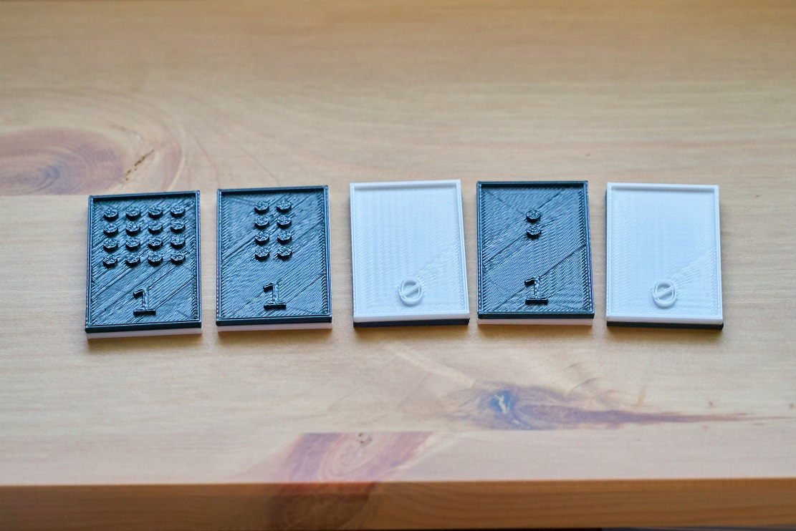
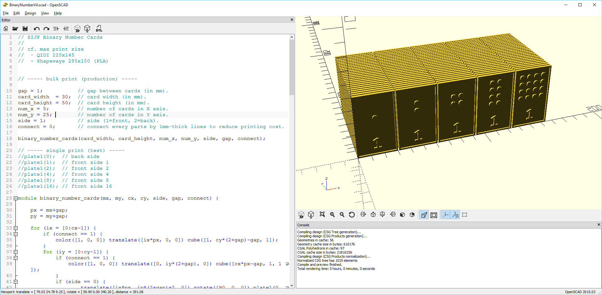
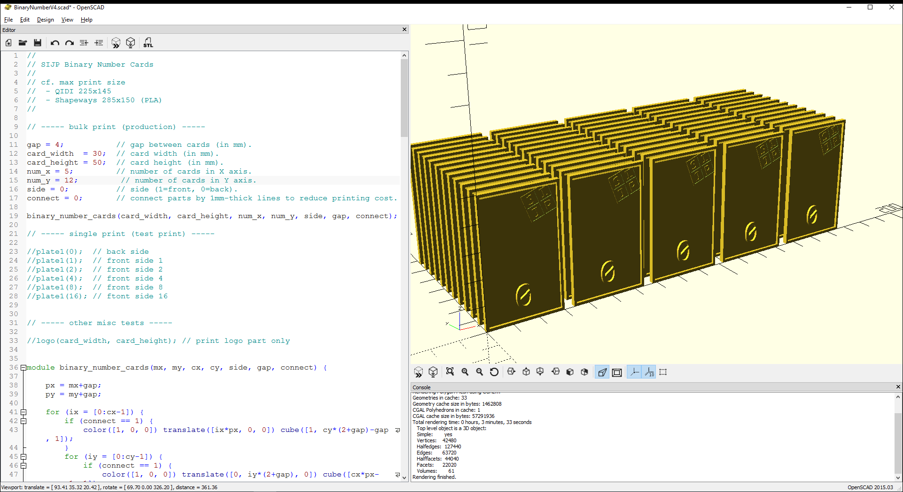

# 2進数カード

SIJP Coding Camp Jr. で使っている、子供たちに2進法を教えるためのカードのミニチュア版です。

## 3Dモデルの概要

この3Dモデルは二色印刷に対応しています。
二色印刷対応のプリンタであれば表と裏を一度に印刷できます。
一色印刷のプリンタの場合には表と裏を別々に印刷したあと接着剤で貼り付けます。

## 公開しているファイル

以下のファイルを公開しています。*.1.stlは表、*.0.stlは裏のモデルです。

* 印刷用のSTLファイル
  * 5枚1セット用
  * 5枚12セット用
  * 5枚25セット用

* Makerbot Desktop用のthingファイル
  * 5枚1セット用（2色印刷版）

* 編集用の[OpenSCAD](http://www.openscad.org/)ソースコード

OpenSCADソースコードを使うと、冒頭のパラメータを調整することによりお手元のプリンタの仕様に合わせてカスタマイズできます。

## 二色印刷の手順(Makerbot Desktop)

* thingファイルを読み込みます。または、
* 表と裏のSTLファイルを両方とも Makerbot Desktop で読み込みます。裏面のモデルをクリックして Y軸方向に +2mm 移動します。これで表と裏がぴったり接着します。
* SETTINGS画面で、両方のノズルの温度を適切に設定します。Purge Wall を有効にします。パラメータはデフォルトのままで構いません。
* PRINTをクリックして印刷開始します。
