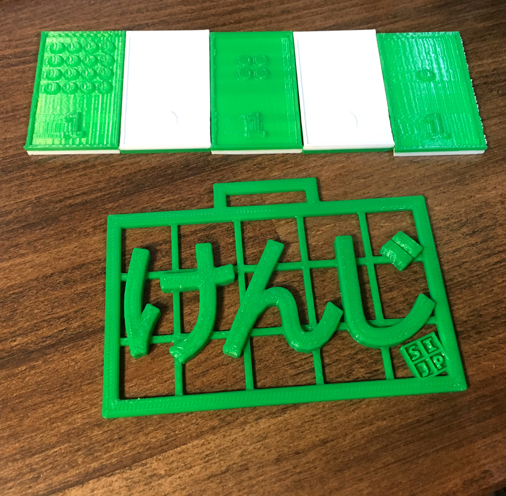

# Name Badge

This is name badge model for SIJP staff and participants used in Coding Camp classes.

## File list

 * STL file for general printing (\*.stl)
 * [OpenSCAD](http://www.openscad.org/) source code (\*.scad) for editing/customization.
    * [IPAexGothic font](http://ipafont.ipa.go.jp/) is required.

## How to print

This model is for single extrusion (single color). 
Just open the STL file and print it. No raft/support is required.

## How to customize

Currently there are 3 functions defined such as 2-char, 3-char and 4-char.
Depending on character, you can fine tune X,Y positions and font size.
(Please refer to the comments at the beginning of the source file for details.)
